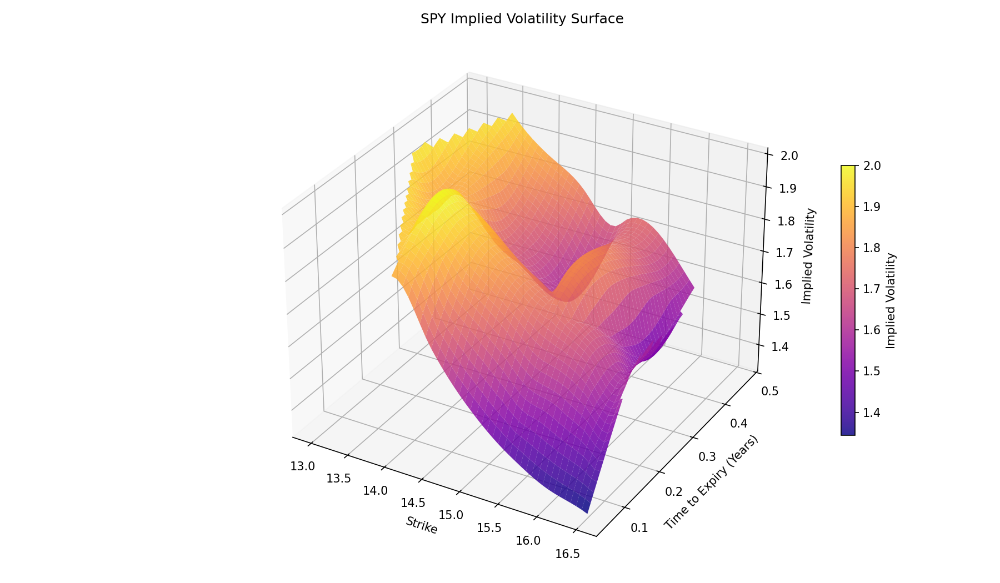
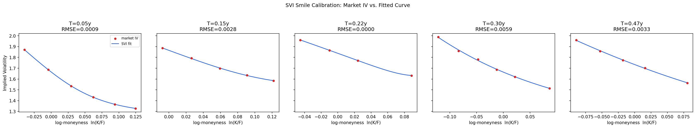

# Options Portfolio Risk & Volatility Modeling Engine

An options analytics and risk engine built around a real, live VIX implied volatility surface: extracts IV from market option prices, fits a parametric smile model, and uses it to price and risk-manage a multi-option portfolio end to end - Greeks, stress scenarios, VaR/ES (historical, analytic, and Monte Carlo), and model backtesting.

## What It Does

- Extracts Black-Scholes implied volatility from live VIX option chains and flags static-arbitrage violations (calendar, butterfly)
- Computes analytical Greeks (delta, gamma, vega, theta, rho), validated against finite differences
- Prices and risk-aggregates a multi-leg option portfolio
- Runs spot/vol/rate stress scenarios via full repricing
- Computes VaR/ES three ways - historical simulation, Monte Carlo full revaluation, and closed-form Delta-Normal/Delta-Gamma - and compares them directly
- Backtests VaR calibration with the Kupiec proportion-of-failures test
- Fits an SVI (Stochastic Volatility Inspired) parametric smile to each expiry of live VIX data, with residual/RMSE diagnostics by moneyness and maturity

## Key Findings

**Greeks**: analytical formulas match finite-difference estimates to within 0.0002 across 200 randomized (S, K, T, σ) trials.

**VaR method comparison** (95%/99%, same portfolio and shock distribution):

| Method | 95% VaR error vs. Monte Carlo | 99% VaR error vs. Monte Carlo |
|---|---|---|
| Delta-Normal | -4.5% | -18.0% |
| Delta-Gamma | -6.9% | -20.9% |

Both linear and quadratic approximations understate tail risk, and the understatement grows sharply at higher confidence - because they can't capture the excess kurtosis in a fat-tailed return distribution the way full Monte Carlo revaluation does.

**VaR backtesting**: the Kupiec test correctly fails to reject a well-calibrated model (10 breaches in 750 days vs. ~7.5 expected at 99%) and correctly rejects a deliberately mis-calibrated one (69 breaches, LR=188, p<0.001).

**Live SVI calibration on real VIX options**: a snapshot taken with VIX spot at 14.54 across 5 expiries (Sept 2026 - Feb 2027, 26 usable contracts total) fits to an overall RMSE of 0.0034 - down from 0.024-0.101 after fixing the optimizer to use bounded differential evolution instead of an unconstrained search, which had been letting parameters collapse to degenerate values (ρ pinned at -1, σ at 0) on sparse data. VIX options typically have only 4-9 usable strikes per expiry against SVI's 5 free parameters, so every slice is flagged with an explicit low-data warning - a real, honest limitation of the instrument rather than something to paper over. The live arbitrage scan also found 2 butterfly violations out of 26 contracts (92.3% arbitrage-free), consistent with wide bid-ask spreads on thinly-traded strikes rather than a modeling bug.

## Tools
- Python
- NumPy
- SciPy (optimization, root-finding, stats)
- pandas
- Matplotlib
- yfinance
